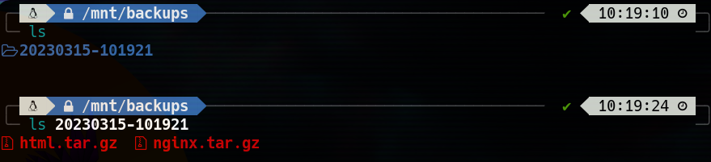

<center>

# BACKUP SCRIPT - PYTHON

**Nahuel Ivan Troisi** <br> **2º ASIR**

## STEP 1

First of all, we need to import the libraries that we have to use, for example:

```python
import os
import time
import tarfile
import logging
import json
import shutil
```

Next, we have to load a previous configuration file. You can use **.conf**, **.ini**, **.json**, etc...

```python
with open("/home/whippy/Descargas/backup_config", "r") as f:
    config = json.load(f)
```

Then, we have to load the previous configuration file to know what directories are being copied and where.

```python
BACKUP_DIRS = config["backup_dirs"]
BACKUP_LOCATION = config["backup_location"]
MAX_BACKUPS = config["max_backups"]
LOG_FILE = config["log_file"]
```
Now we have to prepare the script to load the configuration file **.json**. This file can tell us where to save the backups and how. In addition, we have to configure the backups name with a timestamp and prepare the backup with a **.tar** file. 

```python

logging.basicConfig(filename=LOG_FILE, level=logging.INFO)

backup_folder_name = time.strftime("%Y%m%d-%H%M%S")

backup_folder_path = os.path.join(BACKUP_LOCATION, backup_folder_name)
os.makedirs(backup_folder_path)

for backup_dir in BACKUP_DIRS:
    backup_file_name = os.path.basename(backup_dir) + ".tar.gz"
    backup_file_path = os.path.join(backup_folder_path, backup_file_name)
    
    try:
        with tarfile.open(backup_file_path, "w:gz") as tar:
            tar.add(backup_dir, arcname=os.path.basename(backup_dir))
        
        logging.info("Backup of %s completed successfully.", backup_dir)
        
    except Exception as e:
        logging.error("Backup of %s failed: %s", backup_dir, str(e))
```

Finally, we have to remove the old files when there are more than the maximum allowed and set a **time sleep** to reload this script once per week.

```python
backup_folders = sorted(os.listdir(BACKUP_LOCATION))
while len(backup_folders) > MAX_BACKUPS:
    oldest_backup_folder = backup_folders[0]
    oldest_backup_path = os.path.join(BACKUP_LOCATION, oldest_backup_folder)
    logging.info("Removing oldest backup %s.", oldest_backup_path)
    shutil.rmtree(oldest_backup_path)
    backup_folders = sorted(os.listdir(BACKUP_LOCATION))

    time.sleep(7 * 24 * 60 * 60)
```

## STEP 2

In this case, we have to add in the **.json** file the directories that are being cloned and choose where are saved. 
In addition, select the directory that we save the **.log** files and set the maximum backups. 

```json
{
    "backup_dirs": [
      "/var/www/html",
      "/etc/nginx"
    ],
    "backup_location": "/mnt/backups",
    "max_backups": 5,
    "log_file": "/var/log/backup.log"
  }
```
## CHECKS

Now, we are going to execute the script and check if it`s working. 





</center>


