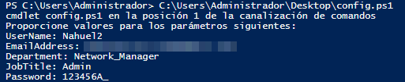
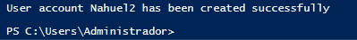
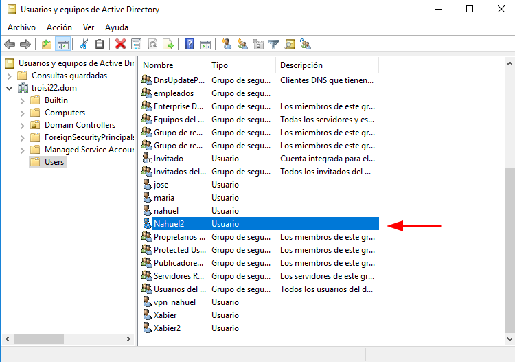

<center>

# ACTIVE DIRECTORY SCRIPT - POWERSHELL

**Nahuel Ivan Troisi** <br> **2º ASIR**

In this task, you have a script in powershell that can create a new user in Active Directory. 

## STEP 1

First of all, we have to define the parameters that we need to create (UserName, Email...). 

```powershell
param(
    [Parameter(Mandatory=$true)]
    [string]$UserName,

    [Parameter(Mandatory=$true)]
    [string]$EmailAddress,

    [Parameter(Mandatory=$true)]
    [string]$Department,

    [Parameter(Mandatory=$true)]
    [string]$JobTitle,

    [Parameter(Mandatory=$true)]
    [SecureString]$Password
)
```

Next, we have to validate the parameters that we create and check if the user already exists. 

```powershell
if (-not ($UserName -and $EmailAddress -and $Department -and $JobTitle -and $Password)) {
    throw "Missing required input parameter(s)"
}

$user = Get-ADUser -Filter {samAccountName -eq $UserName} -ErrorAction SilentlyContinue
if ($user) {
    Write-Host "User $UserName already exists in Active Directory"
    return
}
```

In addition, we generate a secure password and create the new user.

```powershell
$securePassword = ConvertTo-SecureString -String $Password -AsPlainText -Force

New-ADUser -Name $UserName -SamAccountName $UserName -UserPrincipalName "$UserName@yourdomain.com" -EmailAddress $EmailAddress -Department $Department -Title $JobTitle -AccountPassword $securePassword -Enabled $true
```
 
Finally, we add the user, write an email with a temporary password and log all actions. 

```powershell
$groupNames = @()
if ($Department -eq "Sales") {
    $groupNames += "Sales Group"
} elseif ($Department -eq "Marketing") {
    $groupNames += "Marketing Group"
}

if ($JobTitle -eq "Manager") {
    $groupNames += "Managers Group"
}

foreach ($groupName in $groupNames) {
    Add-ADGroupMember -Identity $groupName -Members $UserName
}


$smtpServer = "smtp.yourdomain.com"
$fromAddress = "admin@yourdomain.com"
$toAddress = $EmailAddress
$subject = "Your new user account information"
$body = "Dear $UserName,<br><br>Your new user account has been created. Your temporary password is: $Password.<br><br>Please log in to the system and change your password as soon as possible.<br><br>Best regards,<br>The Admin Team"

$smtp = New-Object Net.Mail.SmtpClient($smtpServer)
$msg = New-Object Net.Mail.MailMessage($fromAddress, $toAddress, $subject, $body)
$msg.IsBodyHtml = $true
$smtp.Send($msg)


$logFilePath = "C:\Logs\AccountCreation.log"
$logMessage = "$(Get-Date) - User account $UserName created by $($env:USERNAME)"
Add-Content -Path $logFilePath -Value $logMessage

Write-Host "User account $UserName has been created successfully"
```

## CHECKS

In this case, we run the script and check if it`s working. 







</center>


