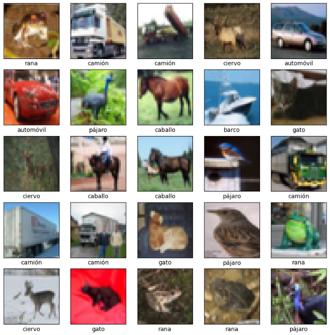
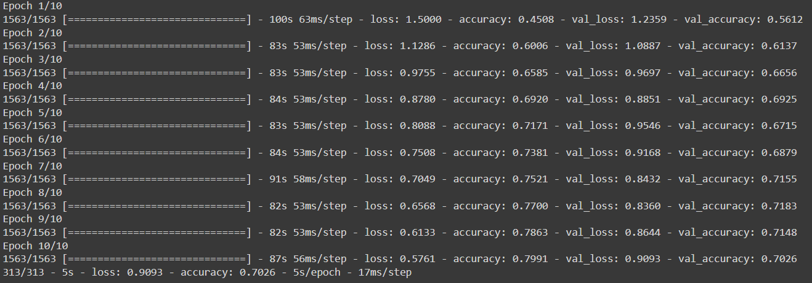
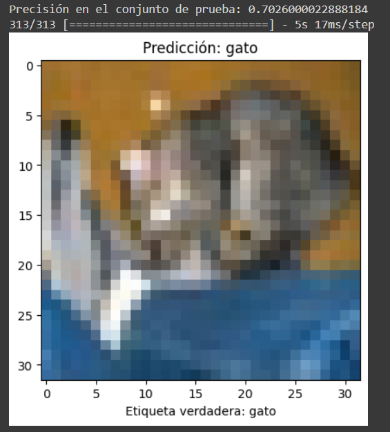

<center>

# CNN - PYTHON

**Nahuel Ivan Troisi** <br> **2º ASIR**

## STEPS

This code uses TensorFlow and Keras to create and train a convolutional neural network (CNN) model to classify images from the CIFAR-10 dataset. The following is a step-by-step explanation of what the code does:


```python
Import the necessary libraries:
import tensorflow as tf
from tensorflow.keras import datasets, layers, models
import matplotlib.pyplot as plt
import numpy as np
```

In this section, TensorFlow and Keras are imported to build and train the CNN model, and other useful libraries such as Matplotlib and NumPy are imported for data visualization.


Load the training and test data:

```python
(train_images, train_labels), (test_images, test_labels) = datasets.cifar10.load_data().
```

The training and test CIFAR-10 datasets containing 32x32 pixel images labeled with one of the 10 different classes are loaded.


Normalize the pixel values:

```python
train_images, test_images = train_images / 255.0, test_images / 255.0.
```

The pixel values of the images are normalized to be in a range between 0 and 1.


Define the output classes:

```python
class_names = ['airplane', 'car', 'bird', 'cat', 'deer', 
               'dog', 'frog', 'horse', 'boat', 'truck']
```


This is a list of the 10 different classes used to label images is defined.

Display some training images:

```python
plt.figure(figsize=(10,10))
for i in range(25):
    plt.subplot(5,5,i+1).
    plt.xticks([])
    plt.yticks([])
    plt.grid(False)
    plt.imshow(train_images[i], cmap=plt.cm.binary)
    plt.xlabel(class_names[train_labels[i][0]])
plt.show()
```

In this code, 25 training images are displayed with their corresponding label in the class list.

Define the CNN model:

```python
model = models.Sequential()
model.add(layers.Conv2D(32, (3, 3, 3), activation='relu', input_shape=(32, 32, 3, 3)))
model.add(layers.MaxPooling2D((2, 2, 2)))
model.add(layers.Conv2D(64, (3, 3, 3), activation='relu'))
model.add(layers.MaxPooling2D((2, 2, 2)))
model.add(layers.Conv2D(64, (3, 3, 3), activation='relu'))
model.add(layers.Flatten())
model.add(layers.Dense(64, activation='relu'))
model.add(layers.Dense(10))
```

After, a CNN model is created with several convolutional and pooling layers, followed by two dense layers. The model uses the activation function ReLU on the convolutional layers and the initial dense layer, and does not use any activation function on the final dense layer.

Compile the model:

```python
model.compile(optimizer='adam',
              loss=tf.keras.losses.SparseCategoricalCrossentropy(from_logits=True),
              metrics=['accuracy'])
```

In this section, we compile the model using the Adam optimizer, the sparse categorical crossentropy loss function and the accuracy metrics.

Train the model:

```python
history = model.fit(train_images, train_labels, epochs=10, 
                    validation_data=(test_images, test_labels))
```

We have to train the model using the training and test data sets, for 10 training epochs.

Evaluate the model on the test set:

```python
test_loss, test_acc = model.evaluate(test_images, test_labels, verbose=2).
print('Accuracy on test set:', test_acc)
```

We evaluate the accuracy of the model on the test set.

Make predictions on some test images:

```python
probability_model = tf.keras.Sequential([model, tf.keras.layers.Softmax()])
predictions = probability_model.predict(test_images)
```

In addition, the trained model is used to make predictions on the test set.

Visualize the predictions for a test image:

```python
img_index = 0
plt.imshow(test_images[img_index], cmap=plt.cm.binary)
plt.xlabel("True label: " + class_names[test_labels[img_index][0]])
plt.title("Prediction: " + class_names[np.argmax(predictions[img_index]))])
plt.show()
```

Finally, a test image is displayed along with its true label and the label predicted by the model.

## CHECKS

Now, we have to run the script and check if it`s works correctly.






